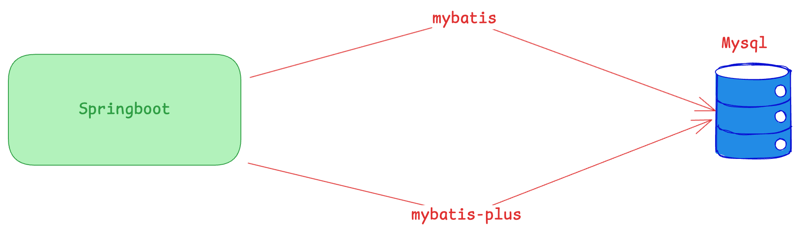

# 项目说明

## 项目内容
一个基于 `Spring Boot` 的在线摄影活动创建和投票的网站。

## 项目目录结构
```text
|-- docs # 文档目录
    |-- developDocs # 开发参考文档
    |-- readme # readme 使用图片和代码
    |-- task # 需求图示文档
|-- src # 源码目录
```

## 项目架构



## 项目依赖
* Spring Boot 3.5
* Jdk 17
* mysql8

## 需求文档

[需求文档说明](docs/task/requirements/需求文档.md)
